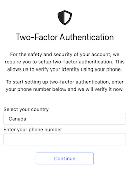
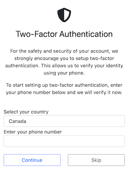

# View-based 2FA Flow

A user should only enter the 2FA flow if:
* They need to register for 2FA
* They have no previous 2FA authentication
* Their previous 2FA authentication has expired and needs to be renewed

Users should enter the flow through the Start view. If they are not registered for 2FA, they will be redirected to the Register view. Otherwise, it is assumed their 2FA authentication has expired.  

How and when to enter into the flow is determined outside the scope of this project. However, there is sample middleware in `test_app/middleware.py` that can be used as a reference.

### Start

This is the primary entrypoint into the 2FA flow.

If `PHONE_NUMBER_CB` returns `None` (indicating the user has not registered for 2FA), the user will be redirected to the Register view.

If only one method is allowed, the verification will be created using that method and user would be redirected to the Verify view. (The user would not see this screen.)

Otherwise, the user is presented with a choice of verification methods.

Template for this view: `start.html`

### Register

If the user has not registered for 2FA and `ALLOW_REGISTER` is `True`, the user will be shown this screen to add a phone number to their account.

If the user has not registered, they will be redirected to the Start view.

If `ALLOW_REGISTER` is `False` and no phone number is available, the user is redirected to the Failed view.

If `REGISTER_OPTIONAL` is `True`, the user has the ability to skip 2FA registration. See that setting for more details.

Template for this view: `register.html`

|  |  |
|-----------------------------------------------------------|---------------------------------------------------------------|
| `REGISTER_OPTIONAL` is `False`                            | `REGISTER_OPTIONAL` is `True`                                 |

### Change

If the user has already registered and wants to change their phone number, this view is shown.

If `ALLOW_CHANGE` or `IS_VERIFIED` is `False`, the user will be shown an error.

It is the exact same view as register except `is_optional` is always `False`.

Template for this view: `change.html`

### Verify

Once the verification has been sent, the user will enter the code on this view. The copy changes based on what method was used.

An incorrect code will show an error message and allow the user to retry up to a total of 5 attempts. 

If the user exhausts all attempts, the user will be redirected to the Failed view.

If the user has not received the verification, they can click on the "Haven't received the <>?" link. If it has been more than the specified time, the verification will be recreated. (See `RETRY_TIME`.)

Template for this view: `verify.html`

### Success

If no `VERIFY_SUCCESS_URL` is defined, the user is redirected to this view upon a successful verification.

Template for this view: `success.html`

### Failed

In case of a verification failure, the user is redirected to this view.

Depending on `RETRY, the user will be able to 

Template for this view: `failed.html`

|  |  |
|----------------------------------------------------------|------------------------------------------------------------|
| User can retry verification                              | User cannot retry verification                             |
